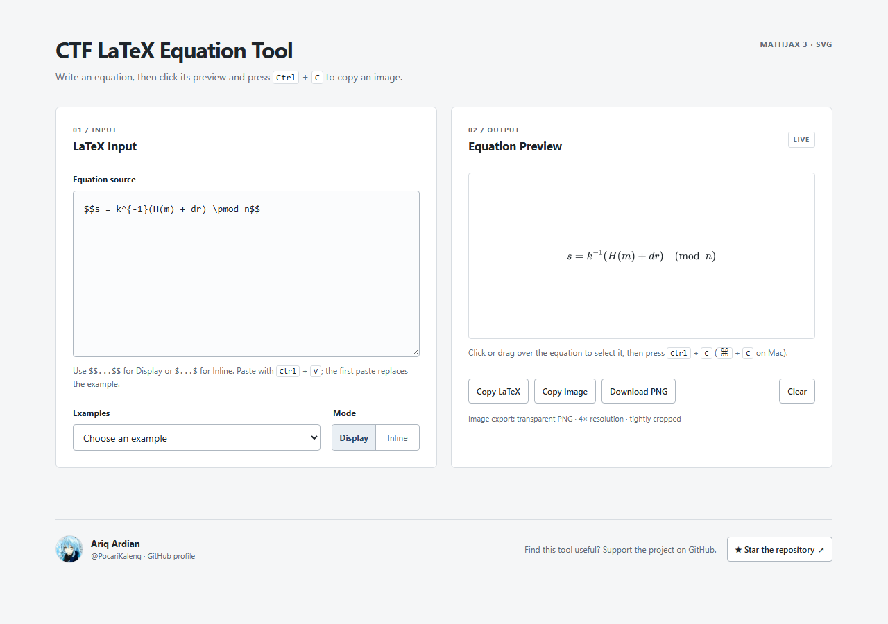

# CTF LaTeX Equation Tool

A small browser tool for writing equations in CTF and cryptography writeups. It previews LaTeX with MathJax 3 and copies the rendered equation as a transparent, high-resolution PNG.

[Live demo](https://pocarikaleng.github.io/Latex-Math-Generate-Equations/) · [Source repository](https://github.com/PocariKaleng/Latex-Math-Generate-Equations) · Built by [Ariq Ardian](https://github.com/PocariKaleng)



## Use

1. Enter `$$e^{i\pi}+1=0$$` for a display equation, or `$e^{i\pi}+1=0$` for an inline equation. Dollar delimiters are required. The examples dropdown inserts them automatically, and the Display/Inline control changes them for you.
2. Click or drag over the rendered equation to highlight it, then press **Ctrl+C** (**Cmd+C** on macOS). Paste the PNG into an app that accepts clipboard images, such as Google Docs or Microsoft Word.
3. Use **Copy Image**, **Download PNG**, or **Copy LaTeX** when you need those specific outputs. Download PNG uses the same cached 4× transparent image as image copying; Copy LaTeX includes the dollar delimiters.

You can paste LaTeX source into the input with **Ctrl+V** (**Cmd+V** on macOS). The first paste replaces the starter example; later pastes follow the normal cursor or selection. An image on the clipboard cannot be converted back into LaTeX source by this tool.

## Run locally

From the project directory:

```bash
python -m http.server 8000
```

Open <http://localhost:8000>. There is no build step or backend. MathJax 3 loads from jsDelivr, so rendering needs an internet connection unless you host that script yourself.

## Browser support

The PNG clipboard action uses `ClipboardItem` with `image/png` and needs a secure context. `localhost` and GitHub Pages provide one. Chrome, Edge, and other Chromium browsers are recommended for image clipboard support. If image writing is unavailable or denied, **Download PNG** remains available. The Ctrl+C image shortcut is handled only while the equation preview has focus; Ctrl+C in the editor retains normal text-copy behavior.

## Deploy

The [Pages workflow](.github/workflows/pages.yml) publishes the static site when `main` changes. It serves `index.html`, `style.css`, `script.js`, and the local profile avatar from GitHub Pages. The project can also be hosted by any static web server.

## Files

```text
index.html                    Interface and MathJax configuration
style.css                     Responsive styling
script.js                     Rendering, clipboard, and PNG export
assets/profile.jpg            Creator avatar
assets/preview.png            README screenshot
.github/workflows/pages.yml   GitHub Pages deployment
README.md                     Project documentation
```
